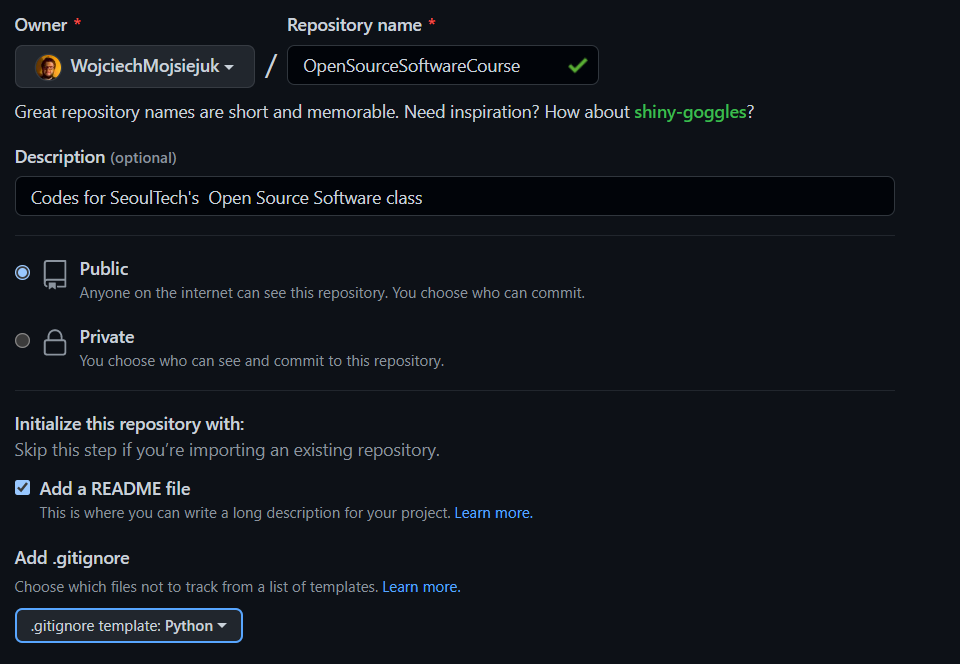
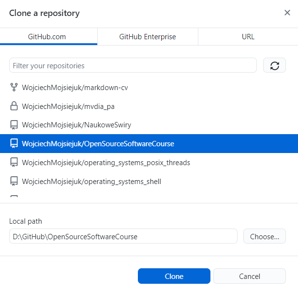
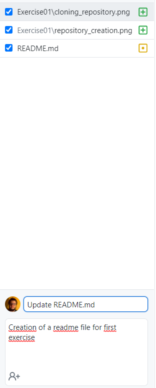

# OpenSourceSoftwareCourse
Codes for SeoulTech's  Open Source Software class

*Assignment*

1. Creating a new repository

2. Cloning repository from server to the local machine using Github Desktop GUI

3. Adding markdown in README.md file

4. Commiting changes locally

5. Pushing changes to the remote server

6. Uploading link to the finished assignment :grinning: